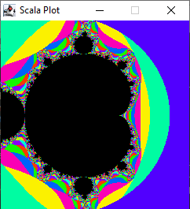

# plot4s


A smart high-level graphic API for Scala (and Java) able to render any *plottable* Object from a single method call.

Supported rendering: Swaning, OpenGL, Console

This project is DRAFT EXPERIMENTAL

## A quick example

Rendering the [Manderbrot Set](https://en.wikipedia.org/wiki/Mandelbrot_set) with a few lines of code:

```scala
object Mandelbrot extends App with Plotting {
  val limit = 200
  val mandelbrot = (cr: Double, ci: Double) => {
    @tailrec def rec(zr: Double, zi: Double, n: Int): Int = if (n >= 200) n
      else if (zr * zr + zi * zi > 2.0) n - 1
      else rec(cr + zr * zr - zi * zi, ci + 2 * zr * zi, n + 1)
    1.0 - rec(cr, ci, 1).toDouble / 200
  }
  mandelbrot.plot()
}
```



The plotting API supports key binding and implements natively zooming (page up/down) and moving (arrows)

